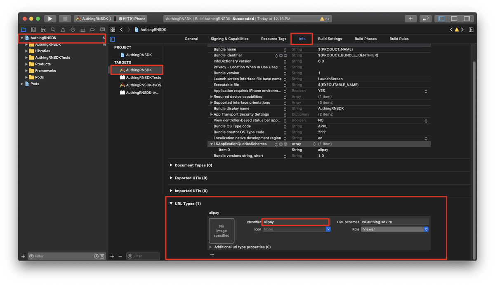

# 如何接入移动端支付宝登录

## 第一步：注册支付宝移动应用

简要过程如下：

- 前往[支付宝开放平台](https://openhome.alipay.com/)。
- [生成一对 RSA 密钥对](https://docs.open.alipay.com/291/105971/)
  - 私钥自己妥善保存。
  - 公钥提交给支付宝换取支付宝公钥。
- 注册移动应用
  - 请确保开启了 “获取会员信息” 功能。


## 第二步：在 Authing 控制台开启支付宝登录

前往 [Authing 控制台](https://authing.cn/dashboard) **第三方登录 - 社会化登录** 页面，开启支付宝登录：


你需要提供你的支付宝移动应用的以下内容：
- AppID（应用 ID）：在 [管理中心 - 我的应用列表](https://openhome.alipay.com/platform/appManage.htm#/apps) 可以获取到。
- AlipayPID（合作伙伴账号 PID）：在 [账号中心 - 合作伙伴管理](https://openhome.alipay.com/platform/accountSetting.htm) 页面可以获取到。
- AppPrivateKey（应用私钥）：上一步生成的应用私钥。

## 第三步：IOS 配置 xcode 运行应用间跳转

由于社会化登录需要拉起支付宝、微信（即将支持）等第三方客户端，IOS 端需要进行额外配置。

### 使用 xcode 打开工程

可以在项目根目录执行：`xed -b ios`。

### 配置 LSApplicationQueriesSchemes

将 `alipay` 添加到 `LSApplicationQueriesSchemes` 列表，这表示允许你的 APP 使用 `canOpenURL` 函数检测第三方应用是否安装。


### 配置 URL Types

将 `identifier` 设置为 `alipay`，`URL Schema` 随意选一个。



### 修改 AppDelegate.m

添加以下代码：

```c
// ...

#import <React/RCTLinkingManager.h>
@implementation AppDelegate
// ...

- (BOOL)application:(UIApplication *)application openURL:(NSURL *)url
  sourceApplication:(NSString *)sourceApplication annotation:(id)annotation
{
  return [RCTLinkingManager application:application openURL:url
                      sourceApplication:sourceApplication annotation:annotation];
}

- (BOOL)application:(UIApplication *)application openURL:(NSURL *)url
            options:(NSDictionary<UIApplicationOpenURLOptionsKey, id> *)options
{
  return [RCTLinkingManager application:application openURL:url options:options];
}
@end
```

